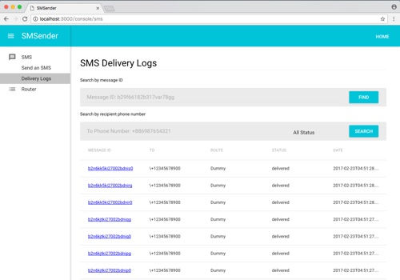
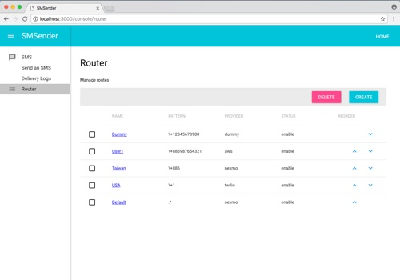

# SMSender

[](https://travis-ci.org/minchao/smsender)
[](https://goreportcard.com/report/github.com/minchao/smsender)

A SMS server written in Go (Golang).

* Support various SMS providers.
* Support routing, uses routes to determine which provider to send SMS.
* Support command line to send a single SMS.
* Support to receive delivery receipts from provider.
* SMS delivery worker.
* SMS delivery records.
* RESTful API.
* Admin Console UI.

## Requirements

* [Go](https://golang.org/)
* MySQL >= 5.7

## Installing

Getting the project:

```bash
go get github.com/minchao/smsender
```

Using the [Glide](https://glide.sh/) to install dependency packages:

```bash
glide install
```

Creating a Configuration file:
 
```bash
cp ./config/config.default.yml ./config.yml
```

Setup the MySQL DSN:

```yaml
store:
  name: "sql"
  sql:
    driver: "mysql"
    dsn: "user:password@tcp(localhost:3306)/dbname?parseTime=true&loc=Local"
```

Registering providers on the sender server.

Add the provider key and secret to config.yml:

```yaml
providers:
  nexmo:
    key: "NEXMO_KEY"
    secret: "NEXMO_SECRET"
```

Build:

```bash
go build -o bin/smsender
```

Run:

```bash
./bin/smsender
```

## Running smsender server in docker container

You can use the [docker-compose](https://docs.docker.com/compose/) to launch the preview version of SMSender, It will start the app and db in separate containers:

```bash
docker-compose up
```

## Providers

Support providers

* [AWS SNS (SMS)](https://aws.amazon.com/sns/)
* [Nexmo](https://www.nexmo.com/)
* [Twilio](https://www.twilio.com/)

Need another provider? Just implement the [Provider](https://github.com/minchao/smsender/blob/master/smsender/model/provider.go) interface.

## Routing

Route can be define a regexp phone number pattern to be matched with provider.

Example:

| Name    | Regular expression  | Provider | Description       |
|---------|---------------------|----------|-------------------|
| Dummy   | \\+12345678900      | dummy    | For testing       |
| User1   | \\+886987654321     | aws      | For specific user |
| Taiwan  | \\+886              | nexmo    |                   |
| USA     | \\+1                | twilio   |                   |
| Default | .*                  | nexmo    | Default           |

## Commands

```bash
./bin/smsender -h
A SMS server written in Go (Golang)

Usage:
  smsender [flags]
  smsender [command]

Available Commands:
  help        Help about any command
  routes      List all routes
  send        Send message

Flags:
  -c, --config string   Configuration file path
  -d, --debug           Enable debug mode
  -h, --help            help for smsender

Use "smsender [command] --help" for more information about a command.
```

### Example of sending a single SMS to one destination

```bash
./bin/smsender send --to +12345678900 --from Gopher --body "Hello, 世界" --provider dummy
```

## RESTful API

The API document is written in YAML and found in the [smsender-openapi.yaml](https://github.com/minchao/smsender/blob/master/smsender-openapi.yaml).
You can use the [Swagger Editor](http://editor.swagger.io/) to open the document.

### Example of creating a Dummy route

Request:

```bash
curl -X POST http://localhost:8080/api/routes \
    -H "Content-Type: application/json" \
    -d '{"name": "Dummy", "pattern": "\\+12345678900", "provider": "dummy", "is_active", true}'
```

Response format:

```json
{
  "name": "Dummy",
  "pattern": "\\+12345678900",
  "provider": "dummy",
  "from": "",
  "is_active": true
}
```

### Example of sending a single SMS to one destination

Request:

```bash
curl -X POST http://localhost:8080/api/messages \
    -H "Content-Type: application/json" \
    -d '{"to": ["+12345678900"],"from": "Gopher","body": "Hello, 世界"}'
```

Response format:

```json
{
    "data": [
        {
            "id": "b3oe98ent9k002f6ajp0",
            "to": "+12345678900",
            "from": "Gopher",
            "body": "Hello, 世界",
            "async": false,
            "route": "Dummy",
            "provider": "dummy",
            "provider_message_id": "b3oe98ent9k002f6ajp0",
            "steps": [
                {
                    "stage": "platform",
                    "data": null,
                    "status": "accepted",
                    "created_time": "2017-04-14T15:02:57.123202Z"
                },
                {
                    "stage": "queue",
                    "data": null,
                    "status": "sending",
                    "created_time": "2017-04-14T15:02:57.123556Z"
                },
                {
                    "stage": "queue.response",
                    "data": null,
                    "status": "delivered",
                    "created_time": "2017-04-14T15:02:57.123726Z"
                }
            ],
            "status": "delivered",
            "created_time": "2017-04-14T15:02:57.123202Z",
            "updated_time": "2017-04-14T15:02:57.123726Z"
        }
    ]
}
```

## Admin Console UI

The Console Web UI allows you to manage routes and monitor messages (at http://localhost:8080/console/).





## License

See the [LICENSE](LICENSE.md) file for license rights and limitations (MIT).
